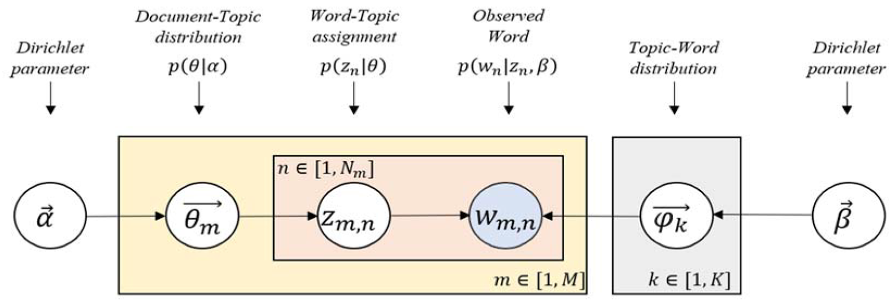

```{r setup, include=FALSE}
knitr::opts_chunk$set(echo = FALSE, message = FALSE, warning = FALSE)
```


```{r, echo=FALSE, message=FALSE, warning=FALSE}
library(tidyverse)
library(tidytext)
library(stm)
library(knitr)
library(stringr)
library(magrittr)
library(stringi)
library(quanteda)
library(topicmodels)
library(wordcloud)
# Read in the data from the csv
covid_2020 <- read.csv("data/covid_2020.csv") %>%   
  tibble::as_tibble() %>%
  mutate(
    publish_month_num = as.numeric(str_sub(publish_time, 7, 7))
  ) %>%
  left_join(
    data.frame(publish_month_num = c(NA, 1:12), publish_month = c(NA_character_, month.abb)),
    by = 'publish_month_num'
  ) %>%
  filter(publish_month_num <= 8 | is.na(publish_month_num)) %>%
  dplyr::select(-publish_month_num) %>%
  mutate(
    publish_month = if_else(is.na(publish_month), "Not Reported", publish_month) %>% factor(levels = c("Not Reported", month.abb))
    ) #%>%
  # filter(abstract_words <= 600)


```


\newpage

# Executive Summary


In 2020, COVID-19 has escalated from a seemingly negligible threat to a global pandemic that has altered nearly ever facet of our lives. Since the initial outbreak in January 2020 to present day, research around the world has been focused on this virus trying to determine information such as what symptoms are most likely, what demographic will be most affected, how to minimize the spread of the virus, and if a potential cure or vaccine can be created to name a few. This research has manifested itself into thousands of published papers and abstracts detailing their results. With this massive amount of information, machine learning techniques such *Latent Dirichlet Allocation* (LDA), a form of topic modeling, can be useful to determine how a collection of documents are related to one another through underlying similarities known as topics. The research question addressed in this paper is what are the topics and related keywords associated with 2020 COVID-19 research? We used LDA to find a predetermined 34 topics, number of topics obtained using the `ldatuning` package in R. The resulting topics can be used to filter abstracts based on which topic is most prevalent in it.


# Data Source


The metadata used for this analysis was obtained from the [semanticscholar.org/Cord19](www.semanticscholar.org/Cord19) (Wang et.al, 2020) website. The data source on this website is updated every day. In this paper, the data from August 8, 2020 were used. The initial data contained information on over 200,000 abstracts. Many of these observations were publications of the same paper in different journals as well as a number published in foreign languages. Additionally, not all articles in these data are based around COVID-19 so publications that did not contain "Coronavirus" or "COVID" in one of the title or abstract were removed. A large number of publications were published in 2019 or earlier, before the initial Coronavirus outbreak, and were filtered out as well. For the purpose of this analysis, the duplicate and foreign publications were removed leaving us with 28,303 English language abstracts from 2020. Further filtering based on abstract length removed another 50 abstracts leaving 28,253 for the full analysis. This dataset contained variables such as publication journal and date, authors, url, etc., but the variables used in this analysis were the unique article ID, the abstract itself, the derived number of words in the abstract, and the month published (if available).


# Exploratory Data Analysis 


The data source used in this paper comes from a massive collection of papers concerning COVID-19, SARS, etc., and the method used to collect the data by Wang et. al was meant to be all inclusive, therefore exploratory data analysis is necessary to determine the initial quality of these data. 


```{r abstract-words, fig.height=3.5, fig.width=5, fig.cap="Histogram of number of words in each abstract colored by month published"}

# Filter to abstracts with at least 30 words because any less than that is just nonsensical and probably a bs article
covid_2020 %>%
  filter(abstract_words >= 30) %>%
  ggplot(aes(x = abstract_words, fill = publish_month)) +
  geom_histogram(bins = 60) + 
  labs(x = "Number of words in abstract", y = "Count", fill = "Published Month") +
  theme_bw()
```

While abstracts are usually around 100-500 words in length, we see in Figure \@ref(fig:abstract-words) that, while few, there are abstracts of up to 1200 words in length. To keep more with standards and to remove right skew from the length of these articles, abstracts that had more than 600 words were removed. It is also apparent in this figure that there are significantly more articles missing a publication month as well as there being relatively few January published articles. The January articles will also be removed from the rest of this analysis.


```{r}
covid_2020_short <- covid_2020 %>%
  dplyr::select(cord_uid, abstract, publish_month) %>%
  group_by(cord_uid) %>%
  mutate(articleID = row_number()) %>%
  ungroup()

tidy_abstracts <- covid_2020_short %>%
  unnest_tokens(word, abstract) %>%
  anti_join(stop_words, 
            by = 'word')


```


```{r word-clouds, fig.ncol = 2, fig.height = 5, out.width = "50%", fig.align = "center", fig.cap="Wordclouds of most commons words in the corpus.", fig.subcap=c('All words included', 'Eight most common words removed')}
tidy_abstracts %>%
  filter(!str_detect(word, pattern = "\\d+")) %>%
  count(word, sort = TRUE, ) %>%
  slice(1:100) %$%
  wordcloud(word, n, colors = brewer.pal(8, "Dark2"))

tidy_abstracts %>%
  filter(!(word %in% c('covid','coronavirus', 'cov', 'patients', 'sars', 'disease','pandemic', 'health') | str_detect(word, pattern = "\\d+"))) %>%
  count(word, sort = TRUE) %>%
  slice(1:75) %$%
  wordcloud(word, n, colors = brewer.pal(8, "Dark2"), scale = c(2, .25))
```


Text normalization is necessary for our analysis. Using the `tidytext` package, the abstracts were separated into individual words with the stopwords removed (words such as "and", "a", "the", etc. that add no real meaning to the sentence). Figure \@ref(fig:word-clouds) contains wordclouds of the most commonly occurring words left in the corpus. Larger text indicates more word occurrences. In (a), we can see that there are around 8 words that occur much more often than others such as "coronavirus", "covid", and "disease" that contain little meaning since they are essentially the topic we are researching. These words were removed and a wordcloud of the remaining words can be seen in (b). With those words removed, a more even distribution of word occurrences can be seen.

```{r, fig.height = 5, fig.width=4, fig.cap="Plot of 6 highest occurring words by month in the whole corpus.", eval=FALSE}
tidy_abstracts %>%
  filter(!str_detect(word, pattern = "\\d+")) %>%
  group_by(publish_month) %>%
  filter(publish_month != "Jan") %>%
  count(word, sort = TRUE) %>%
  slice(1:6) %>%
  # filter(n > 3000) %>%
  mutate(word = reorder(word,n)) %>%
  ggplot(aes(word, n, fill = publish_month)) +
  geom_col() +
  xlab(NULL) +
  ylab("Count") + 
  coord_flip() + 
  theme_bw()  + 
  labs(fill = "Published Month") +
  theme(legend.position = "bottom") +
  facet_wrap(~ publish_month, ncol = 3, scales = "free_x")

```

\newpage

```{r words-months, fig.height = 4.5, fig.cap="Histograms of 6 highest occurring words by month in the corpus."}
tidy_abstracts %>%
  filter(!(word %in% c('covid','coronavirus', 'cov', 'patients', 'sars', 'disease','pandemic', 'health') | str_detect(word, pattern = "\\d+"))) %>%
  group_by(publish_month) %>%
  filter(publish_month != "Jan") %>%
  count(word, sort = TRUE) %>%
  slice(1:6) %>%
  # filter(n > 750) %>%
  mutate(word = reorder(word,n)) %>%
  ggplot(aes(word, n, fill = publish_month)) +
  geom_col() +
  xlab(NULL) +
  ylab("Count") + 
  coord_flip() + 
  theme_bw()  + 
  labs(fill = "Published Month") +
  theme(axis.text.x = element_text(angle = 90)) +
  facet_wrap(~ publish_month, ncol = 4, scales = "free_x")

```


In Figure \@ref(fig:words-months), a plot of the top 6 highest occurring words per month can be seen. Only May and June have the same top 6 occurring words, July and August differ by one word, but all other months have different words giving evidence that the point of interest in COVID-19 has changed over time, and that a variety of different foci have been used

# Method


The method used to analysis this large corpus of COVID-19 research is *Latent Dirichlet Allocation* (LDA), a generative probabilistic model of a text corpus. LDA is used to discover the underlying (*latent*) structures in texts with the topics themselves representing a *Dirichlet* distribution and the words being *allocated* into the different topics.The assumptions of LDA are that each document can be represented by a mixture of topics and each topic is composed of a collection of words (Blei et. al). The model also acts under the bag-of-words assumption: word order in a text does not matter, only the word frequency. If the number of topics to be fit is not determinable by industry knowledge, the `ldatuning` package can be used to find the ideal number of topics by optimizing metrics that go beyond the scope of this paper. The `quanteda` package can be used to create a document-feature matrix from a document-word count dataset which then can be used with the `stm` package to fit the LDA model with a specified number of topics. One of the downfalls of LDA is that it is not possible to compare the correlation between topics.


```{r lda-blue, fig.cap="Overall blueprint of Latent Dirichlet Allocation.", eval=FALSE}
# All defaults

```

```{r}
# The model takes over an hour to run so the resulting model and datasets were saved
# in this .Rdata file and the code to run it included but not evaluated in knitting.
load('data/final_project_workspace.RData')
```


```{r, eval=FALSE}
covid_2020 <- covid_2020[c('cord_uid','abstract')] %>%
  group_by(cord_uid) %>%
  mutate(articleID = row_number()) %>%
  ungroup()

tidy_abstracts <- covid_2020 %>%
  unnest_tokens(word, abstract) %>%
  anti_join(stop_words)


tidy_abstracts <- tidy_abstracts %>%
  filter(!(word %in% c('covid','coronavirus', 'cov', 'patients', 'sars', 'disease','pandemic', 'health') | str_detect(word, pattern = "\\d+")))


word_counts <- tidy_abstracts %>%
  count(cord_uid, word, sort = TRUE)

abstract_dfm <- word_counts %>%
  cast_dfm(cord_uid, word, n)


abstract_dtm <- convert(abstract_dfm, to = "topicmodels")
```


```{r, eval = FALSE}
library(ldatuning)
result <- FindTopicsNumber(
  abstract_dtm,
  topics = seq(from = 2, to = 40, by = 1),
  metrics = c("Griffiths2004", "CaoJuan2009", "Arun2010", "Deveaud2014"),
  method = "Gibbs",
  control = list(seed = 77),
  verbose = TRUE
)
FindTopicsNumber_plot(result)
```


```{r, eval=FALSE}
# lda <- LDA(34)
# terms(lda, 10)

# lda %>% 
#   tidy() %>%
#   group_by(topic) %>%
#   top_n(10, beta) %>%
#   ungroup()  %>%
#   # arrange(topic, desc(beta)) %>% View
#   mutate(topic = paste0("Topic ", topic),
#          term = reorder_within(term, beta, topic)) %>%
#   # filter(topic %in% c("Topic 10", "Topic 17", "Topic 30", "Topic 11", 
#   #                     "Topic 20", "Topic 2")) %>%
#   ggplot(aes(term, beta, fill = as.factor(topic))) +
#   geom_col(alpha = 0.8, show.legend = FALSE) +
#   facet_wrap(~ topic, scales = "free_y") +
#   coord_flip() +
#   theme_bw() + 
#   scale_x_reordered() +
#   labs(x = NULL, y = expression(beta),
#        title = "Highest word probabilities for each topic",
#        subtitle = "Different words are associated with different topics")

abstract_stm <- stm(abstract_dfm, K = 13, verbose = FALSE, init.type = "Spectral")
td_beta <- tidy(abstract_stm)
```


```{r, eval=FALSE}
td_gamma <- tidy(abstract_stm, matrix = "gamma",                    
                 document_names = rownames(abstract_dfm))

ggplot(td_gamma, aes(gamma, fill = as.factor(topic))) +
  geom_histogram(alpha = 0.8, show.legend = FALSE) +
  facet_wrap(~ topic, ncol = 3) +
  labs(title = "Distribution of document probabilities for each topic",
       y = "Number of articles", x = expression(gamma))
```


# Results

```{r gamma, fig.cap="Top 20 topics by prevalence in the COVID-19 corpus with the top words that contribute to each topic."}
library(ggthemes)
library(scales)
library(ggthemes)

top_terms <- td_beta %>%
  arrange(beta) %>%
  group_by(topic) %>%
  top_n(7, beta) %>%
  arrange(-beta) %>%
  dplyr::select(topic, term) %>%
  summarise(terms = list(term)) %>%
  mutate(terms = map(terms, paste, collapse = ", ")) %>% 
  unnest()

gamma_terms <- td_gamma %>%
  group_by(topic) %>%
  summarise(gamma = mean(gamma)) %>%
  arrange(desc(gamma)) %>%
  left_join(top_terms, by = "topic") %>%
  mutate(topic = paste0("Topic ", topic),
         topic = reorder(topic, gamma))

gamma_terms %>%
  top_n(20, gamma) %>%
  ggplot(aes(topic, gamma, label = terms, fill = topic)) +
  geom_col(show.legend = FALSE) +
  geom_text(hjust = 0, nudge_y = 0.0005, size = 3) +
  coord_flip() +
  scale_y_continuous(expand = c(0,0),
                     limits = c(0, 0.115),
                     labels = percent_format()) +
  theme_tufte(ticks = FALSE) +
  theme(plot.title = element_text(size = 16),
        plot.subtitle = element_text(size = 13)) +
  labs(x = NULL, y = expression(gamma))

```

An LDA model with 34 topics was fit to the document-feature matrix generated from a document-word count dataset of our corpus. In Figure \@ref(fig:gamma), a histogram of the top 20 topics can be seen based on their prevalence in the corpus. The $\gamma$ on the x-axis represents the average proportion of documents represented by that topic. Most of the $\gamma$ values are low indicating that no one produced topic is prevalent in all documents. The words on the right of each bar are the top 7 highest probability words for that topic. We can see the top topic has words dealing with the spread and outbreak of the virus around the world. The next topic has words that deal with modeling the data over time in trying to understand the spread of the pandemic. One very interesting topic is Topic 13 that has words dealing with mental and physical health, stress, and the impact of peoples lives. These are issues that are talked about daily on the news and social media on how take care of oneself while quarantining and following social distance practices. Mental health is an aspect of health that should not be overlooked in these difficult times.


From the LDA model, we also receive $\beta$, the probability that a word belongs to that particular topic. In Figure \@ref(fig:beta), a selection of 6 topics can be seen along with the top 10 highest probability ($\beta$) words belonging to that topic. Note that most of these words have a fairly low probability of belonging to any one topic. There is a probability that each word can belong to any topic. Most of these topics can be see above in Figure \@ref(fig:gamma), but it is interesting to see the probabilities for each word belonging to their respective topics. For example in Topic 11, there is a fairly high probability the word China belongs to this topic as well as other words relating to the initial outbreak of COVID-19.


```{r beta, fig.cap="Highest word probabilities for each topic"}
td_beta %>%
  group_by(topic) %>%
  top_n(10, beta) %>%
  ungroup() %>%
  mutate(topic = paste0("Topic ", topic),
         term = reorder_within(term, beta, topic)) %>%
  filter(topic %in% c("Topic 10", "Topic 17", "Topic 30", "Topic 11",
                      "Topic 20", "Topic 2")) %>%
  ggplot(aes(term, beta, fill = as.factor(topic))) +
  geom_col(alpha = 0.8, show.legend = FALSE) +
  facet_wrap(~ topic, scales = "free_y", ncol = 2) +
  coord_flip() +
  theme_bw() + 
  scale_x_reordered() +
  labs(x = NULL, y = expression(beta))

  # filter(topic %in% c("Topic 23", "Topic 24", "Topic 31", "Topic 9",
  #                     "Topic 2", "Topic 13")) %>%
```


# Conclusion


Overall this model did a good job of creating interpretable topics from a large corpus of publication abstracts relating to COVID-19 research in 2020. The results of this model could have many applications such as information retrieval or classifying abstracts. Individual abstracts could be pulled and analyzed to determine which topics they are primarily composed of. Further work using this method would involve using the full paper for LDA analysis and determining if there is a large difference in topics derived from the the abstracts or the full publication.

# References

David M. Blei, Andrew Y. Ng, and Michael I. Jordan. 2003. Latent dirichlet allocation. J. Mach. Learn. Res. 3, null (3/1/2003), 993–1022.


Lu Wang, L., Lo, K., Chandrasekhar, Y., Reas, R., Yang, J., Eide, D., Funk, K., Kinney, R., Liu, Z., Merrill, W., Mooney, P., Murdick, D., Rishi, D., Sheehan, J., Shen, Z., Stilson, B., Wade, A. D., Wang, K., Wilhelm, C., Xie, B., … Kohlmeier, S. (2020). CORD-19: The Covid-19 Open Research Dataset. ArXiv, arXiv:2004.10706v2.